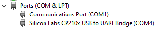
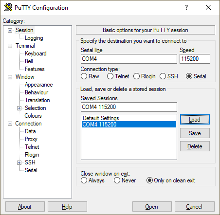

# Wireless midi controller remote
The remote sends commands to the servant.
## 1. Prerequisites
### 1.1 ESP32
Firstly - of course - you will need an `ESP32`. `ESP32`'s come in all sorts and shapes. In my case, I will be using an `Espressif ESP32_DevKitc_V4`, which is a very common `ESP`.

### 1.2 Python
In order to be able to use MicroPython, we will be using `Python`. This means you need to install `Python` (or at least `pip`) before being able to start messing around with `MicroPython`. I highly recommend getting the latest stable [`Python 3+`](https://www.python.org/downloads/).

After installation, you can verify if your installation works by typing this command in a fresh `Command Prompt`.
```cmd
python -V
```
The output for me implies that I am using `Python 3.8.5`.
```cmd
C:\Users\valen>python -V
Python 3.8.5
```

## 2. MicroPython
### 2.1 Installation
First get the appropriate [firmware](https://micropython.org/download/esp32/) for your board. In my case, I use a specific `v4.x` version: `GENERIC : esp32-idf4-20200902-v1.13.bin`.

Secondly, we need to install the `esptool`: 
```shell script
pip install esptool
```

### Deploy firmware
> :warning: **Make sure your `ESP32` is properly connected to your computer.**

First we need to erase the current firmware. To be able to do that, we need to know to which port our `ESP32` is connected to. Open the device manager and look in the Ports view for an indication of your `ESP32`. Mine apparently is registered at port `COM4`.  


Now that we know what port our `ESP32` is connected to, we can remove the current firmware: 
```cmd
esptool.py --port COM4 erase_flash
```

The output should look similar to this:
```cmd
esptool.py v3.0
Serial port COM4
Connecting....
Detecting chip type... ESP32
Chip is ESP32-D0WD (revision 1)
Features: WiFi, BT, Dual Core, 240MHz, VRef calibration in efuse, Coding Scheme None
Crystal is 40MHz
MAC: 8c:aa:b5:b5:86:50
Uploading stub...
Running stub...
Stub running...
Erasing flash (this may take a while)...
Chip erase completed successfully in 17.0s
Hard resetting via RTS pin...
```

Then we write our downloaded firmware to the `ESP32`.
```cmd
esptool.py --chip esp32 --port COM4 write_flash -z 0x1000 esp32-idf4-20200902-v1.13.bin
```

The writing itself might take a couple of minutes. This should be the output more or less:
```cmd
esptool.py v3.0
Serial port COM4
Connecting.....
Chip is ESP32-D0WD (revision 1)
Features: WiFi, BT, Dual Core, 240MHz, VRef calibration in efuse, Coding Scheme None
Crystal is 40MHz
MAC: 8c:aa:b5:b5:86:50
Uploading stub...
Running stub...
Stub running...
Configuring flash size...
Compressed 1456544 bytes to 928552...
Wrote 1456544 bytes (928552 compressed) at 0x00001000 in 82.9 seconds (effective 140.6 kbit/s)...
Hash of data verified.

Leaving...
Hard resetting via RTS pin...
```

### Testing
Now we can test our firmware installation by connection to the `COM4` port at a `Baud rate` of `115200`. There are a couple of tools out there like [TeraTerm](https://ttssh2.osdn.jp/index.html.en) and [PuTTY](https://www.putty.org/) (and mayne more). Since `PuTTY` is a very well known tool and is very easy to use, I will stick to that.  
Install `PuTTY`, open it and create a new session with these settings (save the session):  


When you open the session, and don't see `>>>` or see weird output, then reset the `ESP32` by pressing the reset button on the device (`EN` button).

By following these steps, we now have opened a [`REPL`](https://en.wikipedia.org/wiki/Read%E2%80%93eval%E2%80%93print_loop) connection.

We can now start typing `Python` and `MicroPython` commands. Try a simple `Hello world`:
```python
print("Hello ESP32!")
```
If the output is what we expect, then we can move on to the real work.


pip install adafruit-ampy
ampy --port COM4 put src/main.py

https://www.studiopieters.nl/esp32-pinout/
https://docs.espressif.com/projects/esp-idf/en/latest/esp32/hw-reference/index.html

TTGO

http://www.lilygo.cn/prod_view.aspx?TypeId=50033&Id=1126&FId=t3:50033:3

https://www.instructables.com/TTGO-color-Display-With-Micropython-TTGO-T-display/

```shell
# erase flash
esptool.py --port COM7 erase_flash

# flash firmware
cd workspaces/esptool
python esptool.py --chip esp32 --port COM7 --baud 460800 --before default_reset --after no_reset write_flash -z --flash_mode dio --flash_freq 40m --flash_size detect 0x1000 bootloader/bootloader.bin 0xf000 phy_init_data.bin 0x10000 MicroPython.bin 0x8000 partitions_mpy.bin

# upload main scripth
ampy --port COM7 put remote/src/esp32ttgo/main.py
```

